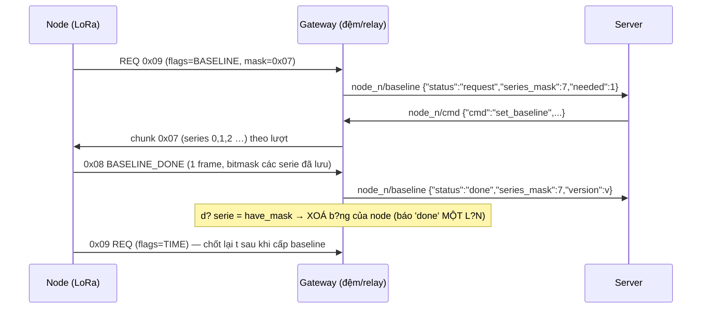

# MQTT Topic Mapping — Gateway IRR

> **Giao tiếp:** Gateway ↔ Server qua MQTT (TLS, port 8883)  
> **Topic format:** `irrigation/<site>/<gateway_id>/node_<node_id>/<suffix>`

---

## 1. Node Data (sensor → server)

**Topic:** `irrigation/<site>/<gw>/node_<n>/data`

**Mục đích:** Node gửi dữ liệu cảm biến định kỳ hoặc theo lệnh `report`.

```json
{
    "node": 1,
    "soil": 45,
    "temp": 28,
    "hum": 65,
    "pump": 0,
    "battery": 85,
    "timestamp": "2026-07-22T10:30:00Z",
    "threshold_exceeded": false
}
```

Khi vượt ngưỡng, payload có thêm thông tin:
```json
{
    "node": 1,
    "soil": 15,
    "temp": 28,
    "hum": 65,
    "pump": 0,
    "battery": 85,
    "timestamp": "2026-07-22T10:30:00Z",
    "threshold_exceeded": true,
    "threshold_low": 30,
    "threshold_high": 70
}
```

| Field | Kiểu | Khoảng | Ý nghĩa |
|---|---|---|---|
| `node` | int | 0-255 | ID node (hex) |
| `soil` | int | 0-100 | Độ ẩm đất (%) |
| `temp` | int | -30..80 | Nhiệt độ (°C) |
| `hum` | int | 0-100 | Độ ẩm không khí (%) |
| `pump` | int | 0/1 | Máy bơm: 0=tắt, 1=bật |
| `battery` | int | 0-100 | Pin (%) |
| `timestamp` | string | ISO 8601 | Thời gian (UTC) |
| `threshold_exceeded` | bool | true/false | **Soil đang ngoài ngưỡng?** |
| `threshold_low` | int | *(chỉ khi exceeded)* | Ngưỡng dưới hiện tại |
| `threshold_high` | int | *(chỉ khi exceeded)* | Ngưỡng trên hiện tại |

> **Cơ chế:** Mỗi khi nhận data từ node, gateway so sánh `soil` với ngưỡng đã cấu hình.  
> Nếu `soil < threshold_low` hoặc `soil > threshold_high`, gateway sẽ:
> 1. Set `threshold_exceeded = true` trong data publish
> 2. Gửi thêm alarm lên topic `.../node_<n>/alarm`

---

## 2. Node Status (sensor → server)

**Topic:** `irrigation/<site>/<gw>/node_<n>/status`

**Mục đích:** Báo trạng thái online/offline của node.

```json
{"node":1,"status":"online","timestamp":1721654400}
{"node":1,"status":"offline","timestamp":1721654400}
```

| Field | Kiểu | Giá trị | Ý nghĩa |
|---|---|---|---|
| `node` | int | 0-255 | ID node (hex, tối đa 10 nodes) |
| `status` | string | `online` / `offline` | Trạng thái |
| `timestamp` | int | UNIX epoch | Thời gian (giây) từ `node_get_time_ms()` |

- **Online:** Khi gateway nhận được bất kỳ packet LoRa nào từ node (data, alarm, **hoặc heartbeat**).
- **Offline:** Khi gateway không nhận packet nào từ node sau **180 giây** (`NODE_TIMEOUT_MS` = 3 phút). Timeout check mỗi **1 giây** (`NODE_MONITOR_PERIOD_MS`).
- **Heartbeat:** Node tự động gửi heartbeat packet (LoRa type `0x02`) mỗi **60 giây** để báo còn sống, *không* publish MQTT — chỉ cập nhật `last_seen` nội bộ.

---

## 3. Node Alarm (sensor → server)

**Topic:** `irrigation/<site>/<gw>/node_<n>/alarm`

**Mục đích:** Cảnh báo từ node hoặc từ gateway khi sensor vượt ngưỡng.

Alarm packet LoRa (type `0x04`) là fire-and-forget — node gửi 1 lần, không ACK, không retry.

### 3a. Alarm từ LoRa packet `0x04` (node → server)

**Kích hoạt:** Node gửi alarm packet type `0x04` qua LoRa. Alarm code được gửi trong cả byte `flags` và `soil` để tăng độ tin cậy — Gateway cross-verify 2 bytes trước khi xử lý.

**Payload MQTT:**

```json
{"node":1,"alarm_code":1,"type":"alarm","message":"Sensor error — 3 consecutive sensor read failures","flags":1}
```

| Field | Kiểu | Giá trị | Ý nghĩa |
|---|---|---|---|
| `node` | int | 0-255 | ID node |
| `alarm_code` | int | 1-5 | Mã alarm (xem bảng mã) |
| `type` | string | `"alarm"` | Loại message |
| `message` | string | text | Mô tả alarm |
| `flags` | int | 0x00-0xFF | Raw flags byte (dự phòng) |

**Bảng mã Alarm codes:**

| Code | Ý nghĩa | Message |
|---|---|---|
| **0x01** | Sensor error — 3 lần đọc cảm biến thất bại liên tiếp | `"Sensor error — 3 consecutive sensor read failures"` |
| **0x02** | Soil out of range — độ ẩm đất < 10% hoặc > 90% | `"Soil out of range — soil moisture < 10% or > 90%"` |
| **0x03** | Relay error — lỗi kích relay bơm (pulse hoặc GPIO fault) | `"Relay error — pump relay fault (pulse or GPIO)"` |
| **0x04** | Low battery — pin < 20% | `"Low battery — battery < 20%"` |
| **0x05** | Gateway lost — Node mất kết nối với Gateway (≥3 ACK timeout) | `"Gateway lost — node lost connection (>=3 ACK timeouts)"` |

> ⚠️ Alarm packet không làm thay đổi dữ liệu cảm biến. Gateway chỉ update `online` status + last_seen, không ghi đè soil/temp/hum/battery từ alarm packet.

### 3b. Alarm do Gateway phát hiện vượt ngưỡng (gateway → server)

**Kích hoạt:** Khi gateway nhận data packet (type `0x01` hoặc `0x06`) có `soil` ngoài ngưỡng hoặc flag `FLAG_THRESHOLD_EXCEEDED` được bật.

**Payload MQTT:**

```json
{"node":1,"soil":15,"type":"alarm","message":"Sensor alarm triggered","threshold_low":30,"threshold_high":70}
```

| Field | Kiểu | Ý nghĩa |
|---|---|---|
| `node` | int | ID node |
| `soil` | int | Giá trị soil trigger |
| `type` | string | `"alarm"` |
| `message` | string | `"Sensor alarm triggered"` (cố định) |
| `threshold_low` | int | Ngưỡng dưới hiện tại |
| `threshold_high` | int | Ngưỡng trên hiện tại |

> **Cơ chế:** Mỗi khi nhận data từ node, gateway so sánh `soil` với ngưỡng đã cấu hình. Nếu `soil < threshold_low` hoặc `soil > threshold_high`, gateway sẽ:
> 1. Set `threshold_exceeded = true` trong data publish
> 2. Gửi alarm lên topic `.../node_<n>/alarm`
>
> **Lưu ý:** Nếu node gửi alarm packet LoRa (type `0x04`) thì chỉ có alarm 3a được gửi — không gây ra alarm 3b.

---

## 4. Gateway Status (gateway → server)

**Topic:** `irrigation/<site>/<gw>/status`

**Mục đích:** Heartbeat định kỳ (mỗi 60s) + báo online/offline.

```json
{"status":"online","nodes_registered":3,"commands_cached":0,"uptime_seconds":120,"version":"1.0.0","site":"factory_1","gateway_id":"gw_01"}
```

Khi mất kết nối (LWT): `{"status":"offline"}`

Khi MQTT vừa kết nối (tại `MQTT_EVENT_CONNECTED`), gateway publish **online ngay lập tức**:

```json
{"status":"online","version":"1.0.0"}
```

| Field | Kiểu | Ý nghĩa |
|---|---|---|
| `status` | string | `online` / `offline` |
| `nodes_registered` | int | Số node đang quản lý |
| `commands_cached` | int | Số lệnh đang đợi gửi |
| `uptime_seconds` | int | Thời gian hoạt động (s) |
| `version` | string | Phiên bản firmware |
| `site` | string | Site identifier (VD: `"factory_1"`) |
| `gateway_id` | string | Gateway identifier (VD: `"gw_01"`) |

---

## 5. Node Command (server → node)

**Topic:** `irrigation/<site>/<gw>/node_<n>/cmd`  
**Gateway subscribe filter:** `irrigation/<site>/<gw>/+/cmd`

**Mục đích:** Server gửi lệnh điều khiển node.

| Lệnh | Tham số | Ví dụ JSON | Mô tả |
|---|---|---|---|
| `on` | `duration` (s) | `{"cmd":"on","duration":60}` | Bật máy bơm N giây |
| `off` | — | `{"cmd":"off"}` | Tắt máy bơm |
| `set_interval` | `value` (s) | `{"cmd":"set_interval","value":300}` | Chu kỳ thức dậy |
| `set_threshold` | `low`, `high` (%) | `{"cmd":"set_threshold","low":30,"high":70}` | Ngưỡng tuyệt đối (soil) |
| `set_delta` | `type`, `value` | `{"cmd":"set_delta","type":0,"value":20}` | Ngưỡng delta (xem bảng dưới) |
| `set_schedule` | `hour`, `minute` | `{"cmd":"set_schedule","hour":6,"minute":0}` | Lịch tưới tự động |
| `report` | — | `{"cmd":"report"}` | Yêu cầu gửi data ngay |
| `toggle` | — | `{"cmd":"toggle"}` | Đảo trạng thái pump |
| `set_mode` | `mode` | `{"cmd":"set_mode","mode":1}` | Chế độ hoạt động |

### Delta types (`set_delta`)

| `type` | Ý nghĩa | `value` | Mặc định | Ví dụ |
|---|---|---|---|---|
| 0 | Nhiệt độ | °C × 10 (20 = 2.0°C) | 20 | `{"cmd":"set_delta","type":0,"value":30}` → 3.0°C |
| 1 | Độ ẩm | % | 5 | `{"cmd":"set_delta","type":1,"value":10}` → 10% |
| 2 | Đất | % | 10 | `{"cmd":"set_delta","type":2,"value":5}` → 5% |
| 3 | Pin | % | 10 | `{"cmd":"set_delta","type":3,"value":5}` → 5% |

> **Lưu ý:** Các lệnh `set_threshold` và `set_delta` không chỉ forward xuống LoRa mà còn cập nhật local cache trên gateway ngay lập tức.

**Khi node online:** Gateway gửi lệnh qua LoRa, nếu thất bại retry 5 lần (1s → 2s → 4s → 8s → 16s). Nếu vẫn thất bại sau 5 lần, lệnh được đưa vào cache chờ retry sau.

**Khi node offline:** Gateway cache lệnh (tối đa 20 lệnh — FIFO eviction nếu đầy).  
Gửi ngay khi node online trở lại (tối đa 20 lệnh cache).  
Mỗi lần gửi retry tối đa 5 lần, drop nếu quá hạn.

---

## 5b. Downlink ACK (gateway → node) — phản hồi khi không có lệnh

**Mục đích:** Đảm bảo node **luôn nhận được phản hồi** sau mỗi uplink (data `0x01`/`0x06`, heartbeat `0x02`, alarm `0x04`) để node reset `gatewayLostCount`. Nếu không có phản hồi, node sẽ chờ ACK, timeout và sau **≥3 lần** tự báo alarm `0x05` "Gateway lost".

**Gói tin downlink ACK (6 byte, header `0x05`):**

```
{ node_id, 0x05, 0x09, 0x00, 0x00, crc }
```

| Byte | Giá trị | Ý nghĩa |
|---|---|---|
| 0 | `node_id` | ID node đích |
| 1 | `0x05` | Header downlink (`LORA_CMD_HEADER`) |
| 2 | `0x09` | `LORA_CMD_ACK` — không có lệnh, chỉ ACK |
| 3-4 | `0x00` | Không tham số |
| 5 | `crc` | CRC8 của bytes 0-4 |

**Cơ chế gateway:**

- Mỗi khi nhận uplink từ node, gateway gọi `ack_or_flush_node(node_id)`:
  - Nếu **có lệnh đang chờ** trong cache → gửi các lệnh đó (bản thân gói lệnh cũng là phản hồi, node reset `gatewayLostCount`).
  - Nếu **không có lệnh** → gửi gói ACK rỗng `0x09` để node không phải chờ.

> **Ghi chú node firmware:** Khi nhận gói downlink command `0x09`, node **không thực thi lệnh nào**, chỉ cần reset `gatewayLostCount` (coi như gateway còn sống) và KHÔNG gửi ACK ngược lại.

---

## 6. Gateway Config (server → gateway)

**Topic:** `irrigation/<site>/<gw>/config`

**Mục đích:** Server gửi cấu hình xuống gateway (dành cho phát triển sau này).

> **Hiện tại:** Gateway dùng cấu hình tĩnh mặc định — không cần server gửi config.  
> **TODO:** Remote config: đổi MQTT broker, WiFi, tham số hệ thống.

---

## 7. Baseline (node ↔ gateway ↔ server) — gateway là bộ đệm/relay

**Topic:** `irrigation/<site>/<gw>/node_<n>/baseline` (gateway ↔ server)
**Topic lệnh:** `irrigation/<site>/<gw>/node_<n>/cmd` với `{"cmd":"set_baseline", ...}`

Gateway **KHÔNG phải nguồn của baseline** — nó chỉ là bộ đệm LoRa. Bảng baseline do
server cung cấp; gateway giữ tạm trong RAM đúng cho node đang được cấp, gửi xong thì xoá.



**Quy tắc (đúng như thiết kế hệ thống):**

1. Node thiếu baseline → gửi `0x09 REQ`. Gateway **chuyển ngay** request đó cho server
   dưới dạng `{"status":"request","series_mask":m}` và **giữ lượt** cho node đó.
2. `"needed": 1` được thêm vào khi gateway **đang không giữ bảng nào** cho node — server
   phải push lại `set_baseline`. Gateway không tự tạo được bảng.
3. **Tuần tự 1 node / 1 thời điểm:** nếu node khác cũng REQ trong lúc node hiện tại đang
   được cấp, gateway **xếp request vào hàng đợi (FIFO)** và **CHƯA báo server**; chỉ khi
   node đang phục vụ báo `0x08 done` đủ series (lượt được trả tự do, log
   `Relaying queued baseline request of node 0xXX …`) thì request kế tiếp mới được gửi
   cho server để server push bảng cho node đó.
4. Khi node đã lưu **đủ** các series mà gateway đang giữ (`have_mask`), gateway **xoá bảng
   của node** (log `baseline session COMPLETE - table dropped`) và gửi server **ĐÚNG MỘT
   message `done`** cho node đó: `{"node":N,"status":"done","version":v,"series_mask":m}`
   (trước đây là 3 message, mỗi serie một message).
5. Node báo xong bằng **1 frame `0x08` mang bitmask** (`field` 3..7 = bitmask, 0/1/2 = một
   serie khi chỉ có 1) — gửi 3 frame rời nhau từng bị mất frame thứ 2 (echo + ACK xen giữa).
6. Sau khi cấp xong baseline, node **LUÔN gửi thêm 1 REQ time** (`flags=TIME`) để chốt lại
   `t` theo gateway trước khi bắt đầu so sánh nội suy (log `Boot sync: baseline xong …
   gửi REQ TIME cuối để chốt t`).
7. Node không uplink nữa → lượt tự trả sau `BASELINE_TURN_TIMEOUT_MS` = 120 s, riêng trường
   hợp **đã gửi hết chunk mà thiếu frame DONE** thì trả sau `BASELINE_DONE_WAIT_MS` = 15 s.
8. `set_baseline` schema mới: `{"cmd":"set_baseline","version":v,"series":[[[t,y]…],[[t,y]…],[[t,y]…]]}`
   — series nào không đổi thì để `null`/`[]` (gateway bỏ qua series đó).

**Trục thời gian `t` (0..95) = GIỜ TRONG NGÀY, không reset theo lần cấp baseline:**

- Gateway lấy giờ thực bằng **SNTP** (`pool.ntp.org`) và tính `t = phút trong ngày / 15`
  → cấp baseline lúc 14:00 thì `t ≈ 56`; gateway reboot cũng KHÔNG làm `t` về 0
  (trước đây `t` đếm từ lúc gateway khởi động → sai thời điểm trong ngày).
  Khi chưa có giờ thực, gateway tạm đếm từ lúc khởi động và ghi log cảnh báo.
- Server có thể chỉnh giờ địa phương: `{"cmd":"sync_slot","slot":N}` = "hiện tại là slot N
  trong ngày" → gateway lưu offset so với UTC (khác với chế độ cũ `slot_ms` = reset base về 0).
- Node nhận `t` từ mọi downlink và tự cộng thời gian trôi qua (RTC) → `t` vẫn đúng giờ trong
  ngày sau nhiều lần deep-sleep; **không reset `t` khi lưu baseline**.
- Node so sánh dữ liệu đo với baseline nội suy **tại đúng `slot` hiện tại**
  (`baseline_should_send(data, config_get_slot(), …)`), log `Baseline dev: series=… slot=…`.
- Log để kiểm chứng: gateway `Đã có giờ thực (SNTP): t hiện tại = N (giờ trong ngày)`;
  node `Baseline stored (mask=0xNN) at slot t=N`.

---

## Tổng kết

| # | Topic | Hướng | Định dạng |
|---|---|---|---|
| 1 | `.../node_<n>/data` | Node → Server | JSON sensor |
| 2 | `.../node_<n>/status` | Node → Server | online/offline |
| 3 | `.../node_<n>/alarm` | Node → Server | cảnh báo |
| 4 | `.../<gw>/status` | Gateway → Server | heartbeat |
| 5 | `.../node_<n>/cmd` | Server → Node | lệnh (gồm `set_baseline`) |
| 6 | `.../node_<n>/baseline` | Gateway → Server | `request`/`done` (+ `needed`) |
| 7 | `.../<gw>/config` | Server → Gateway | *(TODO)* |
